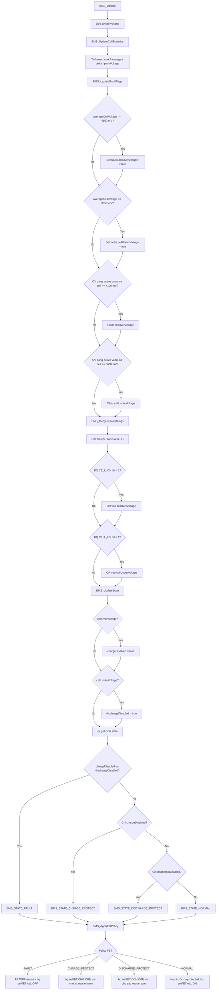
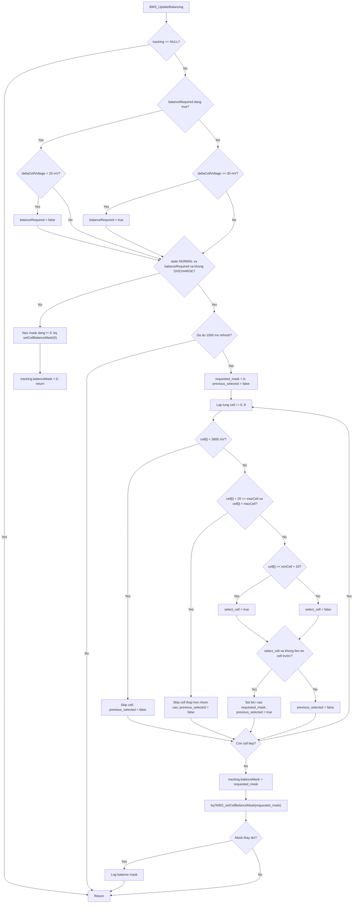
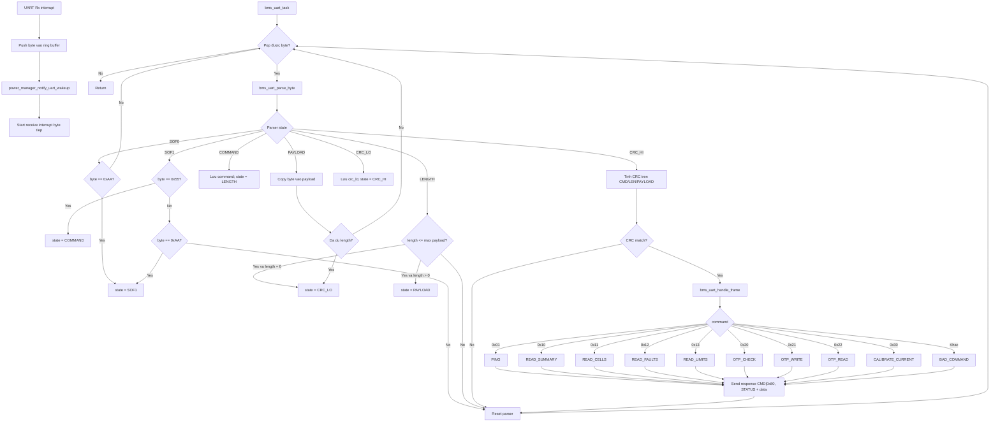
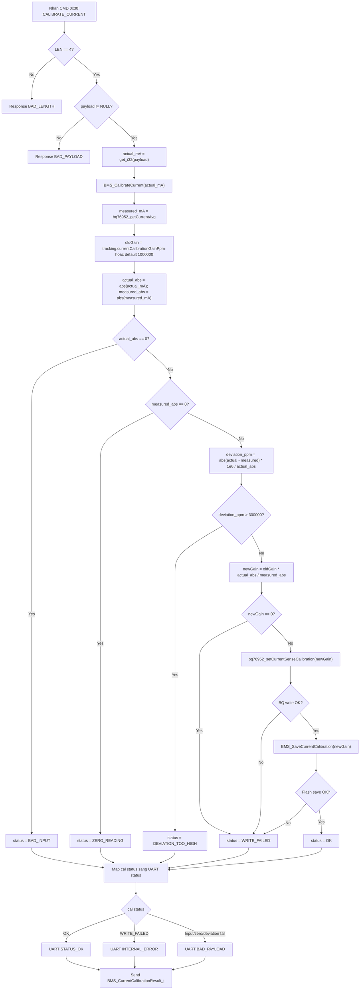
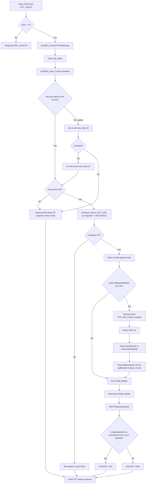
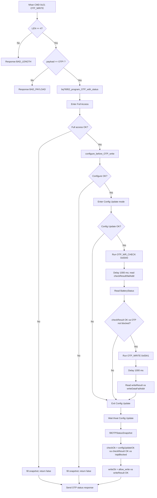
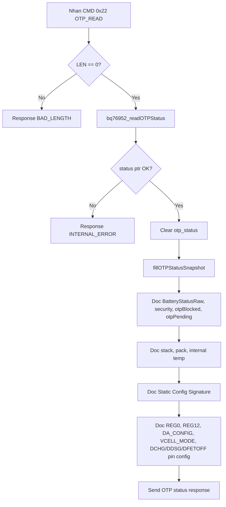

# Lưu Đồ Thuật toán BMS

Tài liệu lưu đồ thuật toán mã nguồn BMS:

- `BMS/Core/Src/main.c`
- `BMS/App/mainapp.c`
- `BMS/MyMiddlewares/bms/bms.c`
- `BMS/MyDrivers/bq76952/bq76952.c`
- `BMS/MyDrivers/bms_uart/bms_uart.c`
- `BMS/MyDrivers/power/power_manager.c`


## 1. Lưu Đồ Tông thể dự án

```mermaid
flowchart TD
    A["Reset / power on MCU"] --> B["HAL_Init"]
    B --> C["SystemClock_Config"]
    C --> D["MX_GPIO_Init"]
    D --> E["MX_ADC_Init"]
    E --> F["MX_LPTIM1_Init"]
    F --> G["MX_RTC_Init"]
    G --> H["MX_USART2_UART_Init"]
    H --> I{"BMS_UART_PROTOCOL_ENABLE?"}
    I -- "1" --> J["bms_uart_init(&huart2)"]
    I -- "0" --> K["debug_log_init(&huart2)"]
    J --> L["while(1): mainapp()"]
    K --> L

    L --> M{"mainapp initialized?"}
    M -- "No" --> N["Enable_Power_Battery"]
    N --> O["BMS_Init"]
    O --> O1["BMS_ResetTracking"]
    O1 --> O2["BMS_ConfigureHardwarePins"]
    O2 --> O3["bq76952_init / I2C soft init"]
    O3 --> O4{"BQ76952 connected?"}
    O4 -- "No" --> O5["BMS_Error_Handler: tat FET, tat balance, FAULT"]
    O4 -- "Yes" --> O6["BMS_LoadPersistedData"]
    O6 --> O7["BMS_ConfigureMonitor: cau hinh BQ protections, FET, sleep, balance"]
    O7 --> O8["BMS_Update lan dau"]
    O8 --> P["Set last_activity_tick, last_update_tick"]
    M -- "Yes" --> Q["bms_uart_task"]
    P --> Q

    Q --> R{"Da du 100 ms?"}
    R -- "No" --> L
    R -- "Yes" --> S["BMS_Update"]

    S --> S1["Tinh dt_ms"]
    S1 --> S2{"BQ76952 connected?"}
    S2 -- "No" --> S3["Set communicationFault"]
    S3 --> S4["BMS_Error_Handler"]
    S4 --> L
    S2 -- "Yes" --> S5["BMS_ReadMeasurements"]
    S5 --> S6["BMS_HandleHardwareSignals"]
    S6 --> S7["BMS_UpdateBatteryAdc mỗi 1000 ms"]
    S7 --> S8["BMS_UpdateCellStatistics"]
    S8 --> S9["BMS_UpdateCurrentDirection"]
    S9 --> S10["BMS_UpdateFaultFlags"]
    S10 --> S11["BMS_MergeBQFaultFlags"]
    S11 --> S12["BMS_UpdateCoulombCounter"]
    S12 --> S13["BMS_UpdateState"]
    S13 --> S14["BMS_ApplyFetPolicy"]
    S14 --> S15["BMS_UpdateBalancing"]
    S15 --> S16["BMS_SavePersistedDataIfNeeded"]
    S16 --> S17["circle_counter++, initialized = true"]
    S17 --> T["mainapp doc tracking va log"]
    T --> U{"Co charge/discharge activity?"}
    U -- "Yes" --> V["last_activity_tick = now"]
    U -- "No" --> W["Kiem tra Điều kiện sleep"]
    V --> W
    W --> X{"Du Điều kiện sleep?"}
    X -- "No" --> L
    X -- "Yes" --> Y["Chay luong sleep/wake"]
    Y --> L
```



## 2. Lưu Đồ Luồng Xử Lý UV / OV

Nguong trong source:

- BQ hardware OV: `BMS_CELL_OV_CUTOFF_MV_BQ = 4180 mV`, delay `3000 ms`.
- BQ hardware UV: `BMS_CELL_UV_CUTOFF_MV_BQ = 3500 mV`, delay `3000 ms`.
- MCU software OV set theo `averageCellVoltage >= 4150 mV`.
- MCU software UV set theo `averageCellVoltage <= 3550 mV`.
- OV recover khi tat ca cell `<= 4100 mV`.
- UV recover khi tat ca cell hop le `>= 3650 mV`.



## 3. Lưu Đồ Luồng Xử Lý Over Current Charge(OCC), Over Current Discharge(OCD), Short Current

Giá trị ngưỡng:

- Deadband: `300 mA`.
- OCC software: `abs(current) >= 1000 mA` va direction la charge.
- OCD software: `abs(current) >= 75000 mA` va direction la discharge.
- Short-circuit software: `abs(current) >= 120000 mA`.
- Recovery OC software: current ve deadband `<= 300 mA` lien tuc `10000 ms`.
- Direction: `current_mA > 300` la charge, `current_mA < -300` la discharge.

```mermaid
flowchart TD
    A["BMS_ReadMeasurements"] --> B["current_mA = bq76952_getCurrentAvg"]
    B --> C["BMS_UpdateCurrentDirection"]
    C --> D{"current_mA > +300 mA?"}
    D -- "Yes" --> D1["currentDirection = CHARGE"]
    D -- "No" --> E{"current_mA < -300 mA?"}
    E -- "Yes" --> E1["currentDirection = DISCHARGE"]
    E -- "No" --> E2["currentDirection = IDLE"]

    D1 --> F["BMS_UpdateFaultFlags"]
    E1 --> F
    E2 --> F
    F --> G["abs_current = abs(current_mA)"]

    G --> H{"abs_current >= 120000 mA?"}
    H -- "Yes" --> H1["Set shortCircuit = true"]
    H -- "No" --> I
    H1 --> I{"abs_current >= 1000 mA va direction = CHARGE?"}
    I -- "Yes" --> I1["Set chargeOverCurrent = true; clear charge recovery pending"]
    I -- "No" --> J
    I1 --> J{"abs_current >= 75000 mA va direction = DISCHARGE?"}
    J -- "Yes" --> J1["Set dischargeOverCurrent = true; clear discharge recovery pending"]
    J -- "No" --> K
    J1 --> K{"abs_current <= 300 mA?"}

    K -- "No" --> K1["Reset OC recovery timers"]
    K -- "Yes" --> L{"chargeOverCurrent active?"}
    L -- "Yes, chua pending" --> L1["Start charge recovery timer"]
    L -- "Yes, pending va du 10 s" --> L2["Clear chargeOverCurrent"]
    L -- "No" --> M
    L1 --> M{"dischargeOverCurrent active?"}
    L2 --> M
    M -- "Yes, chua pending" --> M1["Start discharge recovery timer"]
    M -- "Yes, pending va du 10 s" --> M2["Clear dischargeOverCurrent"]
    M -- "No" --> N
    M1 --> N
    M2 --> N
    K1 --> N

    N["BMS_MergeBQFaultFlags"] --> O["Doc Safety Status A"]
    O --> P{"OC_CHG bit?"}
    P -- "Yes" --> P1["OR chargeOverCurrent"]
    P -- "No" --> Q
    P1 --> Q{"OC1_DCHG hoac OC2_DCHG bit?"}
    Q -- "Yes" --> Q1["OR dischargeOverCurrent"]
    Q -- "No" --> R
    Q1 --> R{"SC_DCHG bit?"}
    R -- "Yes" --> R1["OR shortCircuit; bqSafetyFault = shortCircuit"]
    R -- "No" --> S
    R1 --> S["BMS_UpdateState"]

    S --> T{"shortCircuit hoac communicationFault?"}
    T -- "Yes" --> T1["BMS_STATE_FAULT"]
    T -- "No" --> U{"chargeOverCurrent?"}
    U -- "Yes" --> U1["chargeDisabled = true"]
    U -- "No" --> V
    U1 --> V{"dischargeOverCurrent?"}
    V -- "Yes" --> V1["dischargeDisabled = true"]
    V -- "No" --> W["State theo chargeDisabled/dischargeDisabled"]
    V1 --> W
    W --> X["BMS_ApplyFetPolicy: tat CHG, DCH hoac ALL theo state"]
```



## 4. Lưu Đồ Cân Bằng Cell

Code hiện tại: `BMS_UpdateBalancing()` chạy sau khi state/FET policy đã được cập nhật. MCU tạo `balanceMask` manual và gửi xuống BQ qua API `bq76952_setCellBalanceMask()`.

Giá trị ngưỡng:

- Start delta: `30 mV`.
- Stop delta: `20 mV`.
- Min cell voltage de duoc balance: `3800 mV`.
- Refresh mask: `1000 ms`.
- Khong balance khi state khac `NORMAL` hoac dang discharge.



## 5. Lưu Đồ Sleep và Wake Up

Source hiện tại trong `mainapp.c`:

- Chu kì awake update: `100 ms`.
- Điều kiện idle trước sleep: `1` phút.
- RTC auto wake timeout: `2` gio.
- Alert pin idle level: `GPIO_PIN_RESET` theo define hiện tại.
- Chuẩn bị ALERT: clear alarm tối đa `3` lần, mỗi lần đợi `2 ms`.

```mermaid
flowchart TD
    A["mainapp mỗi 100 ms"] --> B["BMS_Update va đọc tracking"]
    B --> C{"Có charge/discharge activity?"}
    C -- "Yes" --> C1["last_activity_tick = now"]
    C -- "No" --> D
    C1 --> D["MainApp_IsPackSleepEligible"]

    D --> E{"initialized va connected?"}
    E -- "No" --> Z["Không sleep"]
    E -- "Yes" --> F{"state == NORMAL?"}
    F -- "No" --> Z
    F -- "Yes" --> G{"BMS_IsFaultActive == false?"}
    G -- "No" --> Z
    G -- "Yes" --> H{"balanceRequired == false va balanceMask == 0?"}
    H -- "No" --> Z
    H -- "Yes" --> I{"currentDirection IDLE va !charging va !discharging?"}
    I -- "No" --> Z
    I -- "Yes" --> J{"bqSleepAllowed?"}
    J -- "No" --> Z
    J -- "Yes" --> K{"now - last_activity_tick >= 1 phút?"}
    K -- "No" --> Z
    K -- "Yes" --> L["Delay 1000 ms trước sleep"]

    L --> M["MainApp_PrepareAlertWakeLine"]
    M --> M1["Clear Alarm Status 0xFFFF"]
    M1 --> M2["Delay 2 ms; đọc alarm_status va ALERT pin"]
    M2 --> M3{"alarm_status == 0 va ALERT idle?"}
    M3 -- "No, còn retry" --> M1
    M3 -- "No, hết retry" --> M4["Log sleep blocked; alert_ready = false"]
    M3 -- "Yes" --> N["alert_ready = true"]

    N --> O["bq76952_prepareSleepWithReg2"]
    O --> O1["Apply REG1/REG2 on"]
    O1 --> O2["Gui DEEPSLEEP hai lan"]
    O2 --> O3["Poll Control Status tối đa 10 lan, mỗi lan 100 ms"]
    O3 --> O4{"DEEPSLEEP bit set?"}
    O4 -- "No" --> P["bq_sleep_ready = false"]
    O4 -- "Yes" --> Q["bq_sleep_ready = true"]
    M4 --> P

    Q --> R["Disable_Power_Battery"]
    R --> S["power_manager_enter_low_power_sleep(2 gio)"]
    S --> S1["Set RTC wake timer neu timeout > 0"]
    S1 --> S2["Disable ADC/LPTIM clocks; switch low power clock"]
    S2 --> S3["HAL_PWR_EnterSLEEPMode(WFI)"]
    S3 --> T{"Wake source interrupt"}
    T -- "RTC" --> T1["HAL_RTCEx_WakeUpTimerEventCallback set WAKEUP_RTC"]
    T -- "GPIO" --> T2["ALERT/DCHG/DDSG EXTI set WAKEUP_GPIO"]
    T -- "UART" --> T3["UART Rx/Error callback set WAKEUP_UART"]
    T1 --> U["Restore run clock va peripheral clocks"]
    T2 --> U
    T3 --> U
    U --> V["Enable_Power_Battery"]
    V --> W["bq76952_resumeFromSleep: EXIT_DEEPSLEEP, delay 300 ms, REG1/REG2 on"]
    W --> X["BMS_Update; bms_uart_task; update last_update_tick"]
    X --> Y{"wake_source?"}
    Y -- "GPIO/UART/unknown" --> Y1["last_activity_tick = now"]
    Y -- "RTC" --> Y2["Không reset last_activity_tick"]
    Y1 --> Z
    Y2 --> Z

    P --> P1{"bq_sleep_ready = true?"}
    P1 -- "Yes" --> P2["resumeFromSleep"]
    P1 -- "No" --> P3["last_activity_tick = now; log failed"]
    P2 --> P3
```



## 6. Lưu Đồ Giao Tiep Protocol UART

### 6.1. Parser Frame Tong Quat

Frame:

```text
SOF0 SOF1 CMD LEN PAYLOAD[LEN] CRC16_LO CRC16_HI
0xAA 0x55 ... ... ...          ...
```

CRC16 là Modbus/IBM, init `0xFFFF`, tính trên `CMD LEN PAYLOAD`. Response command bằng `CMD | 0x80`; response payload luôn bắt đầu bằng `STATUS`.



### 6.2. Lệnh Calibrate Current / "Carlib" `0x30`

Lệnh `BMS_UART_CMD_CALIBRATE_CURRENT`. 
Payload request dài `4` 
byte little-endian: `actualCurrent_mA:i32`.



### 6.3. Lệnh OTP Check `0x20`



### 6.4. Lệnh OTP Write `0x21`

Độ dài Payload `4` byte va bằng ASCII `OTP!`:

```text
0x4F 0x54 0x50 0x21
```



### 6.5. Lệnh OTP Read `0x22`



